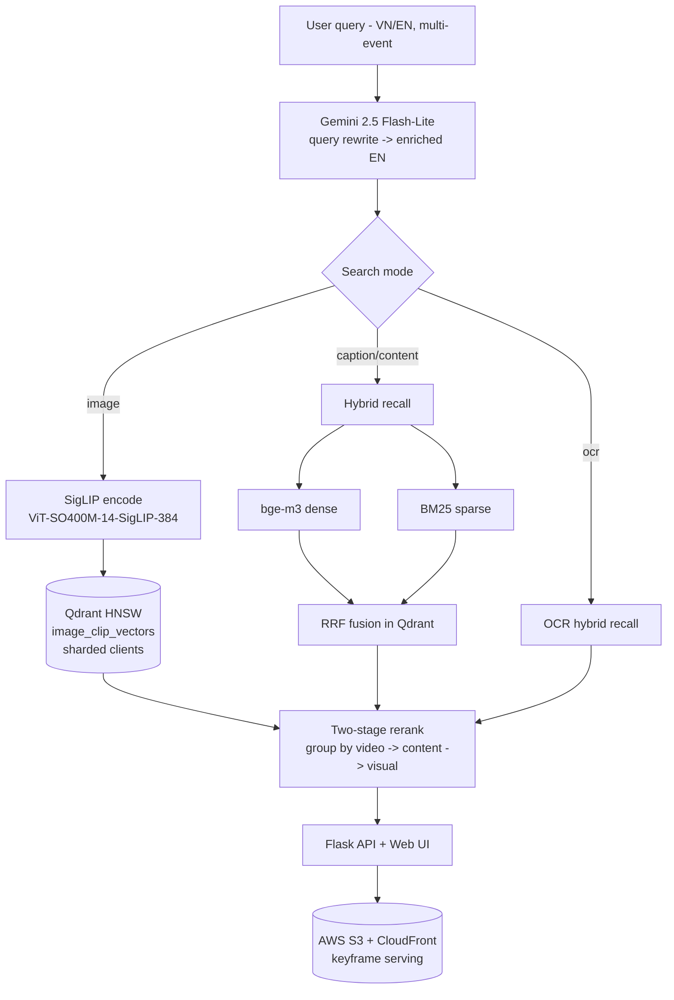

<h1 align="center">🌌 GalaxyAssistant</h1>
<p align="center"><b>An Intelligent Assistant for Multimedia Event Retrieval</b></p>

<p align="center">
  <i>Text-to-video retrieval over a large keyframe corpus — ask in Vietnamese or English,<br/>
  including multi-event temporal queries, and get the exact moment back.</i><br/>
  <sub>Built for the <b>AI Challenge TP.HCM 2025</b>.</sub>
</p>

<p align="center">
  
  
  
  
  
  
  
</p>


---

## Overview

GalaxyAssistant retrieves the precise keyframe (and its parent video) that matches a natural-language description of an event. Users type a query — often a **sequence of events** ("a chef puts fish into a bowl, then pours flour, then tests the oil temperature") in Vietnamese or English — and the system returns ranked video moments, with neighbor-frame browsing to pinpoint the exact shot.

The pipeline combines an **LLM query rewriter**, **SigLIP visual retrieval**, and **hybrid lexical + semantic search** over captions/OCR, fused and reranked into a single ranked list, served through a lightweight web UI for competition submission.

## How It Works

1. **Query rewriting (Gemini 2.5 Flash-Lite).** VN/EN queries are rewritten into enriched but *general* English descriptions optimized for CLIP-style retrieval, preserving event order (E1, E2, …) and camera cues while avoiding over-specific hallucinated details.
2. **Visual recall (SigLIP).** `ViT-SO400M-14-SigLIP-384` (open_clip, `webli`) encodes the query into L2-normalized embeddings; Qdrant runs HNSW search (`hnsw_ef=1000`) over the keyframe vector collection, **sharded across multiple Qdrant clients** for throughput.
3. **Content / caption / OCR recall (hybrid).** A dense encoder (`BAAI/bge-m3`) and a sparse encoder (`BM25`) run as parallel Qdrant prefetches, fused with **Reciprocal Rank Fusion (RRF)** — capturing both semantic and exact-keyword matches.
4. **Two-stage rerank.** Frames are grouped by video; videos are ordered by content score, then frames within each video are ordered by visual score — surfacing the right video *and* the right moment inside it.
5. **Serving.** A Flask (async) app exposes `/query` for the three search modes and `/frames` for neighbor-frame browsing; keyframes are served from **AWS S3 via CloudFront**.

## Architecture



## Search Modes

| Mode | Recall strategy | Backing store |
|---|---|---|
| **Image** | SigLIP text→image embedding, HNSW `hnsw_ef=1000` | `image_clip_vectors` (Qdrant) |
| **Caption / Content** | Hybrid dense (`bge-m3`) + sparse (`BM25`), RRF fusion | `hybrid_content_collection` (Qdrant) |
| **OCR** | Hybrid dense + sparse over OCR text | Qdrant |

All three services run concurrently via `ThreadPoolExecutor` (64 workers) behind an async Flask endpoint, with optional **topic/temporal filtering** by video ID.

## Tech Stack

| Layer | Technologies |
|---|---|
| **Retrieval models** | open_clip (SigLIP `ViT-SO400M-14-SigLIP-384`), BAAI/bge-m3, BM25 (fastembed) |
| **Query understanding** | Google Gemini 2.5 Flash-Lite |
| **Vector DB** | Qdrant (HNSW, RRF fusion, sharded clients) |
| **Serving** | Flask (async), ThreadPoolExecutor |
| **Storage / CDN** | AWS S3, CloudFront (boto3) |
| **Core** | PyTorch, Transformers, sentence-transformers |

## Getting Started

> ⚠️ Adjust to your environment. Requires a running Qdrant instance and prebuilt collections.

```bash
git clone https://github.com/KinhNguyenVan/aic-2025.git
cd aic-2025

pip install -r requirements.txt

# configure keys
export GOOGLE_API_KEY=<your_gemini_key>
# + Qdrant / AWS credentials in your .env

# run the web app
python app.py            # serves the search UI on http://localhost:5000
```

Quick retrieval sanity check (text → keyframes):
```bash
python main.py           # encodes a sample query and prints top-20 Qdrant hits
```

## Project Structure
```
aic-2025/
├── app.py                 # Flask app: /query (image|caption|ocr), /frames
├── main.py                # standalone retrieval sanity check
├── src/
│   ├── search/
│   │   ├── model.py           # SigLIP, Gemini, bge-m3, BM25 encoders
│   │   ├── search_method.py   # image / hybrid content / caption / OCR recall
│   │   ├── search_service.py  # concurrent search services (async, 64 workers)
│   │   └── qdrant_db.py       # Qdrant client(s)
│   ├── rerank/rerank.py       # two-stage content→visual rerank
│   └── utils.py
├── s3/                    # S3 + CloudFront managers (keyframe serving)
├── templates/ static/     # web UI + submission page
├── reports/               # paper.pdf + posters
└── requirements.txt
```

## My Role

**Search Core Engineer.** I owned the retrieval engine end to end:
- The **hybrid recall** design (SigLIP visual + `bge-m3`/`BM25` with RRF fusion)
- **Qdrant** indexing, sharded multi-client search, and HNSW tuning
- The **two-stage rerank** (video-level content ordering → frame-level visual ordering)
- Concurrent, async **search services** for image / caption / OCR modes

> Team project for AI Challenge TP.HCM 2025. See `reports/paper.pdf` for the full method and results.

## Reports
- 📄 [Technical paper](reports/paper.pdf)
- 🖼️ Posters: [landscape](reports/poster_landscape.pdf) · [portrait](reports/poster_portrait.pdf)

---

<p align="center"><i>Multimodal retrieval with a production mindset — LLM query understanding, hybrid search, and fast serving.</i></p>
